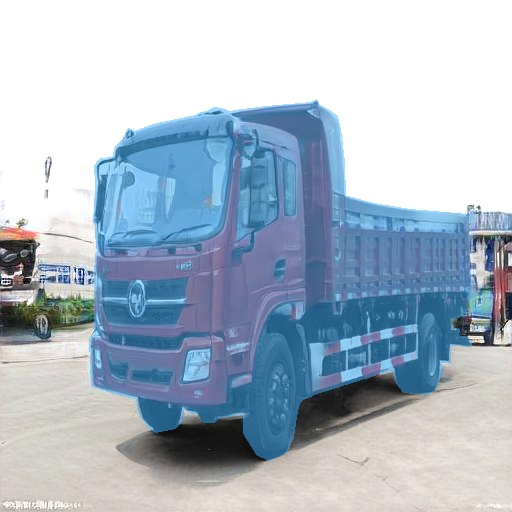

# Improved DatasetGAN

This is an improved DatasetGAN for truck segmentation

For any code dependency related to Ada-Stylegan2, the license is [LICENSE](https://nvlab.github.io/stylegan2-ada-pytorch/license.html).

The code of DatasetGAN is released under the MIT license. See [LICENSE](https://github.com/nv-tlabs/datasetGAN_release/blob/release_finallll/LICENSE.txt) for additional details.

The dataset of DatasetGAN is released under the [Creative Commons BY-NC 4.0](https://creativecommons.org/licenses/by-nc/4.0/) license by NVIDIA Corporation. You can **use, redistribute, and adapt** the material for **non-commercial purposes**, as long as you give appropriate credit by **citing our paper** and **indicating any changes** that you've made.

## Requirements

- Python 3.6
- Pytorch 1.4.0.

## Quick Start

- Please refer to 
- #### DatasetGAN: Efficient Labeled Data Factory with Minimal Human Effort
- #### Training Generative Adversarial Networks with Limited Data
- for detailed setups

## Training 

```
cd datasetGAN
```

#### 1. Interpreter Training 

```
python train_interpreter.py --exp experiments/truck.json 
```

Download [Checkpoints](https://pan.baidu.com/s/1ThOXuKEaU7bWS5Ihi1pCUA) (Password:3t9q)

#### 2. Run GAN Sampling  

```
python train_interpreter.py \
--generate_data True --exp experiments/truck.json  \
--resume [path-to-trained-interpreter in step1] \
--num_sample [num-samples]
```

*Example of annotations*



## Citations

Please ue the following citation if you use our data or code: 

```
@inproceedings{zhang2021datasetgan,
  title     = {Datasetgan: Efficient labeled data factory with minimal human effort},
  author    = {Zhang, Yuxuan and Ling, Huan and Gao, Jun and Yin, Kangxue and Lafleche, Jean-Francois and Barriuso, Adela and Torralba, Antonio and Fidler, Sanja},
  booktitle = {Proceedings of the IEEE/CVF Conference on Computer Vision and Pattern Recognition},
  pages     = {10145--10155},
  year      = {2021}
}
```

```
@inproceedings{Karras2020ada,
  title     = {Training Generative Adversarial Networks with Limited Data},
  author    = {Tero Karras and Miika Aittala and Janne Hellsten and Samuli Laine and Jaakko Lehtinen and Timo Aila},
  booktitle = {Proc. NeurIPS},
  year      = {2020}
}
```

